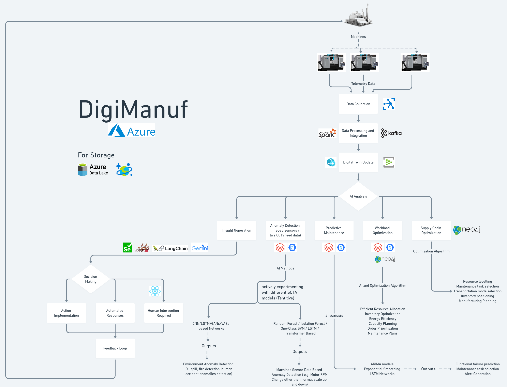

# Overview

DigiManuf is an AI-powered Digital Twin Ecosystem designed to revolutionize the manufacturing industry by enabling real-time monitoring, predictive maintenance, anomaly detection, and intelligent order management. By leveraging advanced technologies such as Artificial Intelligence, IoT, Cloud Computing, Big Data Analytics, and Graph Databases, DigiManuf provides an efficient and scalable solution for optimizing distributed manufacturing environments.

## Features

- Digital Twin Technology: Creates virtual replicas of physical assets and operations, ensuring real-time synchronization and interactive 3D visualizations.
- AI-Powered Anomaly Detection: Continuous monitoring of machine performance and real-time alerts for potential issues.
- Predictive Maintenance: AI-driven analysis of historical and real-time data to schedule optimal maintenance activities.
- Interactive Control and Simulation: Allows users to adjust parameters and simulate changes before implementation for better decision-making.
- Intelligent Order Management: Utilizes AI algorithms for optimal workload distribution and dynamic reallocation of tasks during disruptions.
- Supply Chain Optimization: AI-powered analysis of supply chains to improve resilience and sustainability.
- Computer Vision-Enhanced Safety and Quality Control: Automated hazard detection and quality monitoring using live CCTV feeds.

## Architecture

The entire DigiManuf ecosystem is based on a robust architecture that integrates several cutting-edge services and technologies:

- Frontend: Built using React, the frontend allows for intuitive interaction with the digital twin, analytics dashboard, and real-time control systems.
- Backends:

  - Node.js Backend: Handles real-time API calls, manages data pipelines, and processes user interactions.
  - Python FastAPI Backend: Powers the AI-based predictive and anomaly detection algorithms.
  - Microservices Architecture: The backend follows a microservices architecture, with 8 different microservices responsible for specific functionalities.

- Azure Services:
  - Digital Twin: Enables real-time virtual representation of manufacturing processes.
  - CosmosDB: Used for scalable data storage and real-time data ingestion from distributed units.
  - Key Vault: Ensures secure storage and management of sensitive data and application secrets.
- Other Services: Various Azure services for big data processing, cloud infrastructure, and AI model deployments.

## AI Algorithms

DigiManuf incorporates advanced machine learning models for:

- Anomaly Detection: Detects irregularities in machine performance and operations to prevent costly downtime.
- Predictive Maintenance: Uses historical data and real-time inputs to predict equipment failures and optimize maintenance schedules, reducing unplanned downtime.

## How It Works

1. Data Collection: IoT sensors collect real-time data from machines and operations.
2. Data Processing: Cloud-based systems process the incoming data streams.
3. Digital Twin Update: The virtual replica of the manufacturing operations is updated in real-time based on processed data.
4. AI Analysis: Machine learning models analyze patterns and provide insights into potential issues, performance metrics, and predictive analytics.
5. Control Implementation: The system sends actionable insights to operators, allowing for adjustments in physical operations.
6. Continuous Learning: The AI models continuously evolve as more data is collected.

## System Architecture Diagram



## Installation Instructions

### Prerequisites

- Node.js and npm
- Python 3.8+ and FastAPI
- Azure Subscription with access to:
  - Azure Digital Twin
  - CosmosDB
  - Key Vault
- React for frontend development

### Steps to Deploy

1. Clone the repository:

   ```bash
   git clone https://github.com/your-repo/DigiManuf.git
   cd DigiManuf
   ```

2. Install Frontend Dependencies:

   ```bash
   cd frontend
   npm install
   npm start
   ```

3. Set up Node.js Backend:

   ```bash
   cd backend-node
   npm install
   npm run start
   ```

4. Set up Python FastAPI Backend:

   ```bash
   cd backend-python
   pip install -r requirements.txt
   uvicorn main:app --reload
   ```

   5. Azure Services Configuration:

      - Set up Azure Digital Twin, CosmosDB, Key Vault, and Azure Blob Storage services as per the documentation.
      - Update environment variables in .env files for both backends.

   6. Run the Application:

   - Ensure both backends are running.
   - Access the frontend via localhost:3000 to interact with the system.

## Challenges

- Limited Azure Credits: Restricted access to some advanced services during development.
- Limited Open-Source Resources: Difficulties in finding open-source solutions for specific manufacturing optimizations.
- Data Scarcity: Minimal availability of real-world manufacturing sensor data for AI model training.

## Future Enhancements

- Expansion to more industries such as automotive and aerospace.
- Integration of emerging technologies like 5G and edge computing.
- Advanced simulation capabilities for product development.
- Enhanced sustainability and circular economy features.
- AI-driven autonomous manufacturing operations.

## Contributors

- Neel Shah: neeldevenshah@gmail.com
- Niral Schekhat: 22aiml051@charusat.edu.in

## License

This project is licensed under the GPLv3 License - see the LICENSE file for details.

Feel free to give any suggestions or recommendations, regarding our approach!
